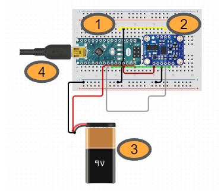
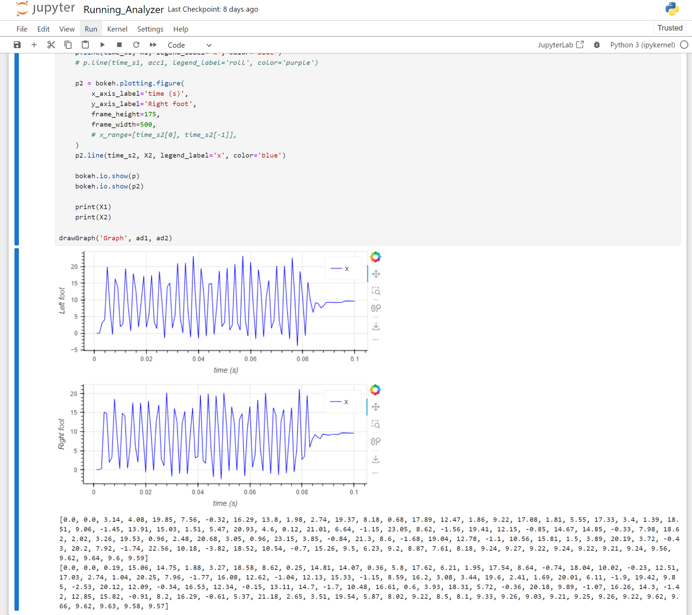
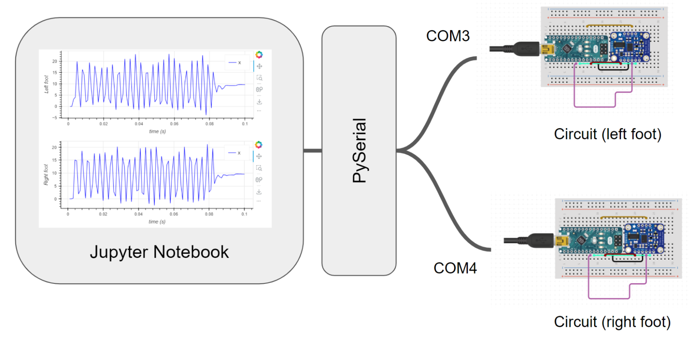
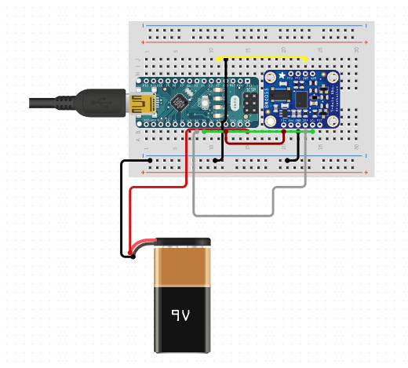
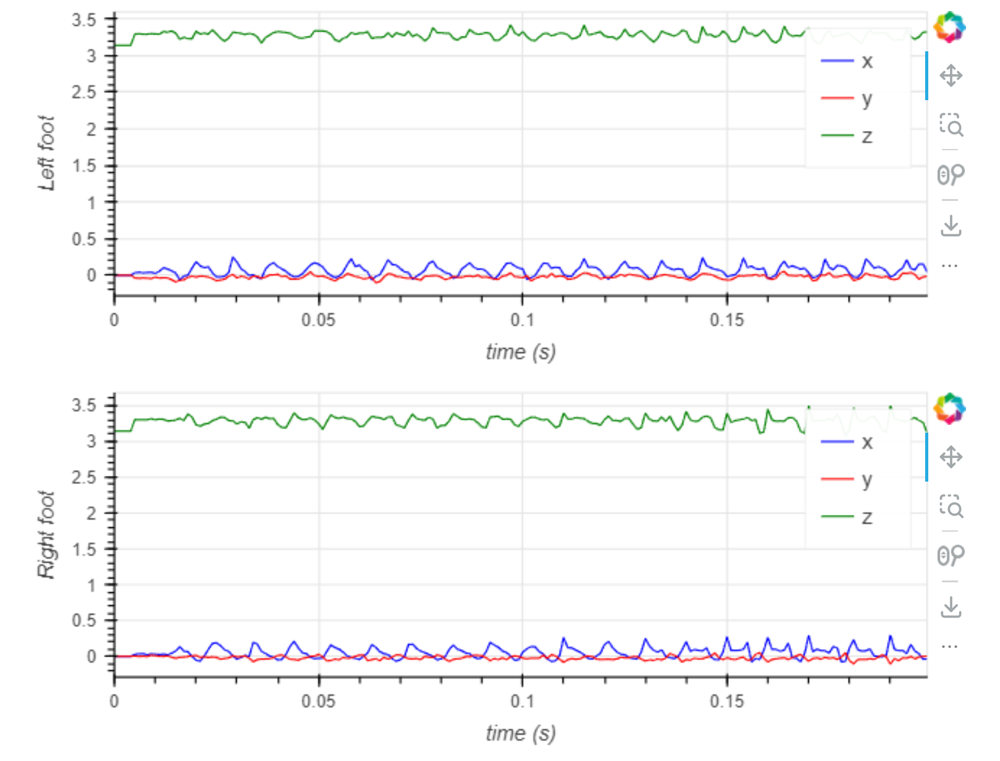
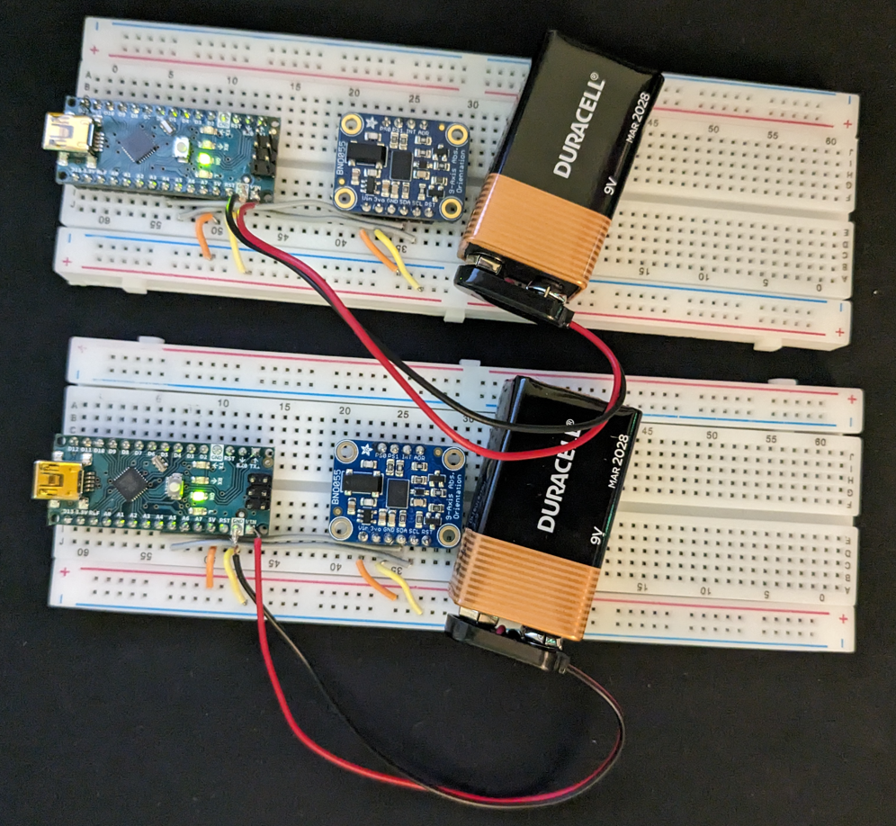

# Running optimization project using Arduinos, IMU sensors and Jupyter Notebook

The goals / steps of this project are the following:
1. Upload code from `running_track.ino` to the circuit
2. Capture data from the two running optimizer circuits (left and right)
3. Analyze the captured data from `Running_Analyzer.ipynb` jupyter notebook.

## Description

As a runner, I’ve experienced my fair share of injuries related to overuse and strain. When a specific muscle or connective tissue is strained, that part of the body won’t be able to produce the same amount of force (and movement is painful). As often the development of strain can be observed by an increasing amount of biomechanical asymmetries, I wanted to see if I could reflect that idea through the capturing of biomechanical data with motion sensors.
My goal is to create a combination of accelerometers and Arduinos to record acceleration over time and transform/translate the data for viewing. Once the data is compiled, I can analyze the data in order to see if the acceleration corresponds to patterns in my running gait and adjust accordingly if there are signs of weaknesses in my body or opportunities to improve my running gait, stride length, and other running technicalities.

## Design Process

The design started with a prototype to solve the problems incrementally.


### 1. Build the circuit

After research, I decided to build a circuit using Arduino Nano because of its small form factor and Adafruit IMU BNO055 sensor for its accuracy. Because I needed a sensor for both feet, I built two identical circuits. 


#### <span style="text-decoration:underline;">The schematics for the circuit:</span>



### 2. Test the circuit

Once I built the circuit, I used Arduino IDE to verify that the circuit is working properly.


```
#include <Wire.h>
#include <Adafruit_Sensor.h>
#include <Adafruit_BNO055.h>
#include <utility/imumaths.h>

#define BNO055_SAMPLERATE_DELAY_MS (100)

Adafruit_BNO055 myIMU = Adafruit_BNO055();

void setup() {
  // Send data to serial monitor
  Serial.begin(115200);
  myIMU.begin();
  delay(1000);
  int8_t temperature = myIMU.getTemp();
  Serial.println(temperature);
  // Use the crystal on the board instead of the chip
  myIMU.setExtCrystalUse(true); 
}

void loop() {
  // Get data from accelerometer, gyroscope and magnetometer
  imu::Vector<3> acc = myIMU.getVector(Adafruit_BNO055::VECTOR_ACCELEROMETER); 

  // Accelerometer
  Serial.print(acc.x());
  Serial.print(",");
  Serial.print(acc.y());
  Serial.print(",");
  Serial.print(acc.z());
  Serial.print(",");

  // Delay so that the loop does not run faster than 
  // the speed of the sensor
  delay(BNO055_SAMPLERATE_DELAY_MS);
}
```

### 3. Extend the circuit to operate offline

The next challenge was to make the circuit operate without being connected to a PC through a USB port. The reason is that I needed to wear the circuit while I am running, and the circuit needed to store data in the Arduino chip itself without relying on a PC or Wi-Fi connection.

I extended the circuit to operate using 9V battery as shown below:




Then, the next step was to make the circuit work without a computer. To do so, I had to find a way for the circuit to persist data while I run without a USB port. To do so, I decided to utilize EEPROM which is available in Arduino Nano. The idea was to store sensor events to EEPROM while I run, and read the stored data when the circuit is connected to a computer for data analysis. Here is the code to do so in Arduino:


```
#include <Wire.h>
#include <Adafruit_Sensor.h>
#include <Adafruit_BNO055.h>
#include <utility/imumaths.h>
#include <CircularBuffer.h>
#include <EEPROM.h>

#define BNO055_SAMPLERATE_DELAY_MS (100)

const int BUFFER_SIZE = 200;
int bufferX[BUFFER_SIZE];
int itemCount = 0;
const int STARTING_EEPROM_ADDRESS = 0;

Adafruit_BNO055 myIMU = Adafruit_BNO055();

bool bufferCleared = false;
bool bufferSaved = false;

void setup() {
  // Send data to serial monitor
  Serial.begin(115200);
  myIMU.begin();
  delay(1000);
  // Use the crystal on the board instead of the chip
  myIMU.setExtCrystalUse(true); 
}

void loop() {
  // Get data from accelerometer, gyroscope and magnetometer
  imu::Vector<3> acc = myIMU.getVector(Adafruit_BNO055::VECTOR_ACCELEROMETER); 

  if (!bufferCleared) {
    EEPROM.get(STARTING_EEPROM_ADDRESS, bufferX);
    for (int i = 0; i < BUFFER_SIZE; i++) {
      Serial.println(bufferX[i]);
    }
    bufferCleared = true;
  } else {
    // Accelerometer
    if (itemCount < BUFFER_SIZE) {
      bufferX[itemCount] = (int)(acc.z() * 100);
      itemCount++;
    } else if (!bufferSaved) {
      EEPROM.put(STARTING_EEPROM_ADDRESS, bufferX);
      bufferSaved = true;
    } else {
      Serial.println("!");
    }
  }

  // Delay so that the loop does not run faster than 
  // the speed of the sensor
  delay(BNO055_SAMPLERATE_DELAY_MS);
}
```

### 4. Analyze data using Jupyter Notebook

The next was to write a program to analyze data from two Arduino circuits (left foot and write foot).


#### High-level overview of Data Analysis

For the data analysis, I used two USB cables each of which is attached to two Arduino circuits, COM3 and COM4 respectively. The data is sent through PySerial to a Jupyter Notebook.


And here is the snippet of the code in Jupyter Notebook for data analysis:

```
from time import *
import numpy as np
import math
import serial

toRad=2*np.pi/360
toDeg=1/toRad

def parse_raw(raw):
    """Parse bytes output from Arduino."""
    dataPacket=str(raw,'utf-8')
    return float(dataPacket) / 100.0

def request_single_row(arduino):
    """Ask Arduino for a single data point"""
    # Read in the data
    raw = arduino.readline()
    # Parse and return
    return parse_raw(raw)

ad1.close()
ad2.close()
ad1 = serial.Serial('com3', baudrate=115200)
ad2 = serial.Serial('com4', baudrate=115200)


def drawGraph(label, ad1, ad2):
    time_ms1 = []
    time_ms2 = []
    X1, X2 = [], []

    i = 0
    while True:
        i += 1
        while ad1.inWaiting() == 0 or ad2.inWaiting() == 0: # no data
            pass
        try:
            x1 = request_single_row(ad1)
            time_ms1.append(i)
            X1.append(x1)
    
            x2 = request_single_row(ad1)
            time_ms2.append(i)
            X2.append(x2)

        except:
            break
        # Wait 20 ms
        # time.sleep(0.02)
        
    time_s1 = np.array(time_ms1) / 1000
    time_s2 = np.array(time_ms2) / 1000
    
    p = bokeh.plotting.figure(
        x_axis_label='time (s)',
        y_axis_label='Left foot',
        frame_height=175,
        frame_width=500,
        # x_range=[time_s1[0], time_s1[-1]],
    )
    p.line(time_s1, X1, legend_label='x', color='blue')
    # p.line(time_s1, acc1, legend_label='roll', color='purple')
  
    p2 = bokeh.plotting.figure(
        x_axis_label='time (s)',
        y_axis_label='Right foot',
        frame_height=175,
        frame_width=500,
        # x_range=[time_s2[0], time_s2[-1]],
    )
    p2.line(time_s2, X2, legend_label='x', color='blue')

    bokeh.io.show(p)
    bokeh.io.show(p2)

    print(X1)
    print(X2)
    
drawGraph('Graph', ad1, ad2)
```

## Feature (with picture)


### Capture runner’s data from both feet

Capture a combination of accelerometers in Arduinos for the left and right foot without the need of a computer.



### Analyze runner’s data





## Components (with picture)

### Hardware



1. Arduino Nano

2. Adafruit 9-DOF Absolute Orientation IMU Fusion Breakout - BNO055

3. 9v battery for offline operation

4. USB port for uploading code to Arduino and accessing data through Jupyter notebook


### Software

1. Arduino IDE

2. Virtual Python: I used Virtual Python for prototyping. For data analysis, I used a Jupyter Notebook. 

3. Jupyter notebook: I used Jupyter Notebook with Bokeh for charts. PySerial has been used for communicating with Ardnuino through serial ports. \
